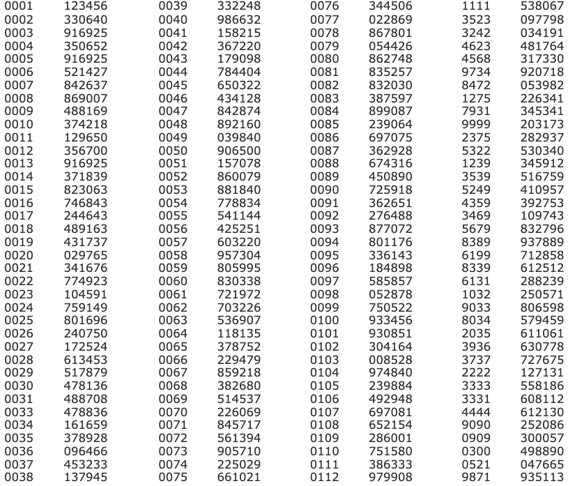

# nemid-code-extractor

A small CLI to read NemID codes for testing purposes. 
It transforms a NemID key card image into key pairs with a key and a code.


## Example image

I made my own example image but you can take a screenshot (125% zoom level) from the NemID developer test site.
https://appletk.danid.dk/developers/OtpCard?CardSerial=XXXXXXXXXX




## Run
```bash
$ nemid-code --image ~/Desktop/nemid.png --key 0001
# will return 123456 if the example image is used
```
    